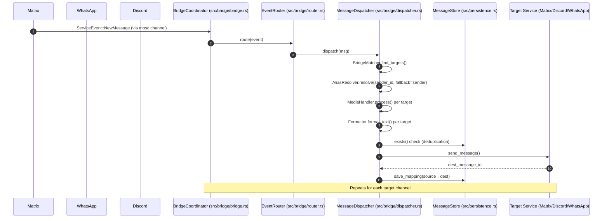

# ARCHITECTURE.md — System Architecture & Codebase Map

> **Purpose:** This document provides a structural map, architectural guidelines, and module breakdown for both human developers and AI assistants. Keep this file updated as key modules, traits, or data flows evolve.

---

## 1. Executive Overview

**Project Goal:** A modular, multi-protocol chat bridge written in Rust. It connects chat channels/rooms across Matrix, WhatsApp, and Discord, allowing seamless multi-service messaging with support for text, media, reactions, and message edits.

### Key Technology Stack
* **Language:** Rust (stable toolchain, 2021 Edition)
* **Async Runtime:** `tokio` (v1.53.0, multi-threaded executor)
* **Matrix Protocol:** `matrix-sdk` (v0.18.0)
* **Discord Protocol:** `serenity` (v0.12.4)
* **WhatsApp Protocol:** `wa-rs`
* **Database:** SQLite via `rusqlite` (v0.37) for message ID mapping
* **Configuration:** YAML via `serde` (v1.0.228) and `serde_yaml` (v0.9.34)
* **Logging:** `log` (v0.4) and `env_logger` (v0.11)
* **GIF Resolution:** Custom providers (Giphy, Tenor, Imgur, Klipy) + Open Graph fallback scraper

---

## 2. Directory & Module Hierarchy

```text
.
├── Cargo.toml               # Project metadata and dependency graph
├── ARCHITECTURE.md          # System architecture and codebase map (this file)
├── AGENTS.md                # AI agent guidelines, build commands, and rules
├── config_example.yaml      # Sample configuration file
├── data/                    # Runtime data (created at runtime)
│   ├── config.yaml          # Active configuration
│   └── message_history.db   # SQLite message ID mappings
└── src/
    ├── main.rs              # Entrypoint, logging, config load, service init, coordinator start
    ├── config.rs            # Configuration structs (Config, ServiceConfig, ChannelConfig)
    ├── persistence.rs       # MessageStore: SQLite wrapper for message ID mappings
    ├── lib.rs               # Library root
    ├── bridge/              # Bridge coordination and message routing
    │   ├── mod.rs           # Module exports
    │   ├── bridge.rs        # BridgeCoordinator: main event loop, service lifecycle
    │   ├── dispatcher.rs    # MessageDispatcher: routing, alias resolution, formatting
    │   ├── router.rs        # EventRouter: delegates to dispatcher/edit/reaction/status handlers
    │   ├── matcher.rs       # BridgeMatcher: finds target channels for a source message
    │   ├── alias_resolver.rs # AliasResolver: maps sender IDs to display names
    │   ├── media.rs         # MediaHandler: applies media/display_name policies per channel
    │   ├── formatter.rs     # MessageFormatter trait + format_sender_content helper
    │   ├── deduplicator.rs  # Deduplicator: in-memory duplicate detection (deprecated)
    │   ├── edit_handler.rs  # EditHandler: forwards message edits across services
    │   ├── reaction_handler.rs # ReactionHandler: syncs reactions across services
    │   ├── status_handler.rs # StatusHandler: handles .status command
    │   └── __tests__/       # Unit tests for bridge components
    ├── gif/                 # GIF/media resolution subsystem
    │   ├── mod.rs           # Exports
    │   ├── resolver.rs      # GifResolver: orchestrates provider chain + fallback
    │   └── providers/       # GIF API providers
    │       ├── mod.rs       # Provider trait + common types
    │       ├── giphy.rs     # Giphy API
    │       ├── tenor.rs     # Tenor API
    │       ├── imgur.rs     # Imgur API
    │       ├── klipy.rs     # Klipy API
    │       └── fallback.rs  # Open Graph image scraper fallback
    ├── services/            # Protocol service implementations
    │   ├── mod.rs           # Service trait + core types (ServiceMessage, ServiceEvent, etc.)
    │   ├── traits.rs        # Fine-grained traits: Connectable, MessageSender, MessageEditor, ReactionSender, MemberLister, ServiceInfo
    │   ├── builder.rs       # ServiceBuilder: constructs services from config
    │   ├── registry.rs      # ServiceRegistry: manages service lifecycle
    │   ├── matrix/          # Matrix protocol implementation
    │   │   ├── mod.rs       # MatrixService: sync loop, event handlers, send/edit/react
    │   │   └── formatter.rs # MatrixFormatter: markdown/HTML formatting
    │   ├── discord/         # Discord protocol implementation
    │   │   ├── mod.rs       # DiscordService: gateway, event handlers, send/edit/react
    │   │   └── formatter.rs # DiscordFormatter: markdown formatting
    │   └── whatsapp/        # WhatsApp protocol implementation
        │   ├── mod.rs       # WhatsAppService: event processing, send/edit/react
        │   └── formatter.rs # WhatsAppFormatter: markdown formatting
```

---

## 3. Core Subsystems & Module Breakdown

### 3.1 Core & Entrypoint (`src/main.rs`, `src/config.rs`)
* **`main.rs`**: Initializes logging, loads `data/config.yaml`, builds services via `ServiceBuilder`, creates `BridgeCoordinator`, starts all services and the routing loop.
* **`config.rs`**: Strongly typed configuration using `serde`. `Config` contains `services` (HashMap of `ServiceConfig` enum: Matrix/WhatsApp/Discord) and `bridges` (HashMap of bridge name → Vec<ChannelConfig>).

### 3.2 Bridge Coordination (`src/bridge/`)
* **`bridge.rs` — `BridgeCoordinator`**: Owns the main routing loop. Creates `EventRouter`, starts all services, waits for readiness, then processes events from the mpsc channel.
* **`router.rs` — `EventRouter`**: Single entry point for all `ServiceEvent` types. Delegates to:
  - `MessageDispatcher` for `NewMessage`
  - `EditHandler` for `UpdateMessage`
  - `ReactionHandler` for `NewReaction`
  - `StatusHandler` for `.status` command
* **`dispatcher.rs` — `MessageDispatcher`**: Core routing logic:
  - Finds target channels via `BridgeMatcher`
  - Checks `bridge_own_messages` policy
  - Resolves sender display name via `AliasResolver`
  - Applies per-target media/display_name policy via `MediaHandler`
  - Formats message using target service's `MessageFormatter`
  - Sends message, saves mapping in `MessageStore`
* **`matcher.rs` — `BridgeMatcher`**: Given source service/channel, returns all other channels in the same bridge.
* **`alias_resolver.rs` — `AliasResolver`**: Resolves `sender_id` → display name using `ChannelConfig.aliases`. Falls back to source service's provided `sender` (display name).
* **`media.rs` — `MediaHandler`**: Strips attachments if `enable_media=false`, clears sender if `display_names=false` for target channel.
* **`formatter.rs`**: `MessageFormatter` trait with `format_text()` and `format_caption()`. Implemented by `MatrixFormatter`, `DiscordFormatter`, `WhatsAppFormatter`.
* **`edit_handler.rs` / `reaction_handler.rs`**: Look up destination message IDs from `MessageStore` and forward edits/reactions.

### 3.3 Persistence (`src/persistence.rs`)
* **`MessageStore`**: SQLite wrapper around `data/message_history.db`.
  - `exists()`: Checks if a message ID has been processed (source or destination)
  - `save_mapping()`: Records source→destination message ID mapping for edits/reactions
  - `get_associated_mappings()`: Finds all related message IDs for a given message
* Schema: `message_map` table with composite PK (source_service, source_channel, source_id, dest_service) + index on source.

### 3.4 Protocol Services (`src/services/`)
* **`traits.rs`**: Fine-grained traits replacing monolithic `Service`:
  - `Connectable`: `connect()`, `start()`, `is_connected()`, `wait_until_ready()`, `disconnect()`
  - `MessageSender`: `send_message()`
  - `MessageEditor`: `edit_message()`
  - `ReactionSender`: `react_to_message()`
  - `MemberLister`: `get_room_members()`
  - `ServiceInfo`: `service_name()`, `as_any()` for downcasting
* **`mod.rs`**: Core types: `ServiceMessage` (sender, sender_id, content, attachments, source_*, is_own), `ServiceEvent::NewMessage|UpdateMessage|NewReaction`, `ServiceUpdate`, `ServiceReaction`, `Attachment`.
* **`builder.rs`**: `ServiceBuilder` constructs `Box<dyn Connectable + MessageSender + ...>` from config.
* **`registry.rs`**: `ServiceRegistry` manages lifecycle: connect → start → wait_ready → shutdown.

#### Matrix Service (`src/services/matrix/`)
* `MatrixService`: Uses `matrix-sdk` client. Sync loop with event handlers for messages, edits (m.replace), reactions. Downloads media via matrix-sdk media API. Sets display name on connect if configured.

#### Discord Service (`src/services/discord/`)
* `DiscordService`: Uses `serenity` with full intents. `DiscordHandler` processes messages (with GIF URL resolution), edits, reactions. Resolves display name via guild nickname → global name → username. Updates bot username on ready if configured.

#### WhatsApp Service (`src/services/whatsapp/`)
* `WhatsAppService`: Uses `wa-rs`. Handles text, media, reactions, edits. Resolves display name from push_name or JID.

### 3.5 GIF Resolution (`src/gif/`)
* **`resolver.rs` — `GifResolver`**: Chains enabled providers (Giphy → Tenor → Imgur → Klipy) with `reqwest` fallback scraper for Open Graph `og:image`. Respects max upload size from Matrix service.

---

## 4. Primary Data & Event Flow



### Message Lifecycle
1. **Receive**: Protocol service receives event → creates `ServiceMessage` with `source_service`, `source_channel`, `source_id`, `sender` (display name), `sender_id` (protocol ID) → sends via mpsc to coordinator
2. **Route**: `BridgeCoordinator` → `EventRouter` → `MessageDispatcher`
3. **Deduplicate**: `MessageStore.exists()` on source triple; skip if seen
4. **Match**: `BridgeMatcher` finds target channels in same bridge
5. **Transform**: For each target:
   - `AliasResolver` resolves display name (alias → sender → sender_id)
   - `MediaHandler` applies target channel's `enable_media` / `display_names`
   - Target's `MessageFormatter` formats text
6. **Send**: `send_message()` on target service → returns destination message ID
7. **Persist**: `save_mapping()` stores source→dest mapping for future edits/reactions

---

## 5. Architectural Invariants & Key Rules

1. **Async Safety & Locking:**
   - Use `tokio::sync::Mutex` for cross-task state; never hold `std::sync::Mutex` across `.await`
   - `MessageStore` uses `Arc<Mutex<Connection>>` internally; all methods are synchronous (SQLite is fast enough)
   - Services communicate via `mpsc` channels; no shared mutable state

2. **Deduplication / Loop Prevention:**
   - **Always** check `MessageStore.exists()` before forwarding (both in `BridgeCoordinator` loop and `MessageDispatcher.dispatch()`)
   - Source services must set `is_own=true` for messages sent by the bot itself
   - `bridge_own_messages` channel config controls whether own messages are bridged
   - Discord ignores messages from other bots (`msg.author.bot`)

3. **Display Name Resolution Priority:**
   1. Configured alias in `ChannelConfig.aliases` (key = `sender_id`)
   2. Source service's provided `sender` (display name from protocol)
   3. `sender_id` (protocol-specific ID) — last resort

4. **Error Handling:**
   - Use `anyhow::Result` for application-level errors
   - Log errors with `error!` but continue processing other targets
   - Never `.unwrap()` or `.expect()` in production paths

5. **Configuration:**
   - All config validated on startup via `Config::load()`
   - Services created via `ServiceBuilder` from config
   - No silent defaults for critical parameters (tokens, URLs)

6. **State Ownership:**
   - `BridgeCoordinator` owns `Config`, `Services`, `MessageStore`, `EventRouter`
   - Services are `Arc<Mutex<Box<dyn Service>>>` for shared access
   - Formatters are `Box<dyn MessageFormatter + Send + Sync>` per service

---

## 6. How to Extend

### Adding a New Protocol Service
1. Implement `Connectable + MessageSender + MessageEditor + ReactionSender + MemberLister + ServiceInfo` in `src/services/<name>/mod.rs`
2. Add formatter in `src/services/<name>/formatter.rs` implementing `MessageFormatter`
3. Add config struct in `config.rs` (`ServiceConfig` enum variant)
4. Register in `ServiceBuilder::build()` and `ServiceBuilder::build_all()`

### Adding a New GIF Provider
1. Implement `GifProvider` trait in `src/gif/providers/<name>.rs`
2. Register in `GifResolver::new()` provider chain

### Adding a New Event Type
1. Add variant to `ServiceEvent` in `src/services/mod.rs`
2. Add handler in `src/bridge/` (e.g., `poll_handler.rs`)
3. Register in `EventRouter::route()`

---

## 7. Testing Strategy

* **Unit Tests (`src/` + `src/bridge/__tests__/`)**: Run via `cargo test --lib`. Tests for formatters, alias resolver, matcher, media handler, dispatcher, router, deduplicator, registry.
* **Integration Tests (`tests/integration_tests.rs`)**: Requires valid `data/config.yaml` with credentials. Run sequentially: `cargo test --test integration_tests -- --test-threads=1`. Tests service connection, message bridging, edits, reactions.

---

## 8. Deployment

### Local
```bash
mkdir -p data
cp config_example.yaml data/config.yaml
# Edit data/config.yaml with credentials
cargo run
```

### Container (Podman/Docker)
```bash
podman build -t gibbz/rosetta:latest .
podman run -d --name rosetta -v ./data:/app/data:Z gibbz/rosetta:latest
```

---

## 9. Key Files Quick Reference

| File | Purpose |
|------|---------|
| `src/main.rs` | Entrypoint, coordinator startup |
| `src/config.rs` | Config structs & loading |
| `src/persistence.rs` | SQLite message ID mapping |
| `src/bridge/bridge.rs` | Main event loop |
| `src/bridge/dispatcher.rs` | Message routing & transformation |
| `src/bridge/router.rs` | Event type dispatch |
| `src/bridge/alias_resolver.rs` | Sender ID → display name |
| `src/bridge/matcher.rs` | Bridge topology resolution |
| `src/bridge/media.rs` | Per-channel media/name policy |
| `src/bridge/formatter.rs` | Formatting trait |
| `src/services/traits.rs` | Service trait definitions |
| `src/services/builder.rs` | Service construction from config |
| `src/services/registry.rs` | Service lifecycle management |
| `src/services/matrix/mod.rs` | Matrix protocol |
| `src/services/discord/mod.rs` | Discord protocol |
| `src/services/whatsapp/mod.rs` | WhatsApp protocol |
| `src/gif/resolver.rs` | GIF provider orchestration |